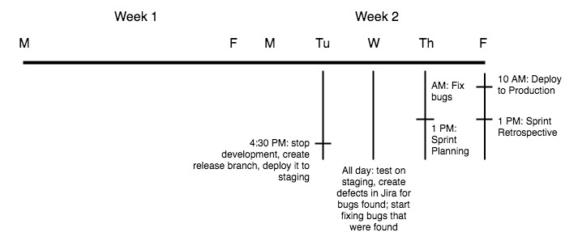

# Release plan

1. At the end of the day, the day before test day, create a release branch off of develop, named after the release
2. Run Jenkins job to deploy release branch to staging server
3. On test day, everyone tests on staging server
4. If bugs are found, then create a defect in Jira, select the project, link as "blocks" to the original story, put sprint as current sprint
    1. If bugs are found, create a "fix branch" off of the release branch, following the usual development procedure
        1. Work on bugs can begin as soon as they are logged in Jira
5. The day after test day, spend the morning trying to fix bugs.
6. Early afternoon on that same day is sprint planning. Any bugs that couldn't get fixed in time are added to the next sprint
7. The day after sprint planning is release day. From Jira, go to the pending release and click Release
    1. If you want to get fancy, you can set up your Jira to trigger a Jenkins job when you click Release
8. Merge the release branch into master and tag the commit as the version number
9. Deploy to production
10. Smoke test production to make sure everything is groovy
11. Merge the release branch into develop to bring over any bug fixes that were made
    1. Do not delete the release branch; we may need to revert to it in the future to address issues specific to that release
12. Instruct developers to write release comments on their completed stories if they deem it necessary